# Host Status App

A comprehensive Angular 19 application for managing bookings, trips, and vehicle services with integrated OAuth2 social media authentication.

## 🏗️ System Architecture

```mermaid
graph TB
    %% Frontend Layer
    subgraph "Frontend Layer (Angular 19)"
        A[Angular App] --> B[Routing Module]
        A --> C[Authentication Module]
        A --> D[Feature Modules]
        
        subgraph "Feature Modules"
            D1[Bookings Module]
            D2[Trips Module] 
            D3[Vehicles Module]
            D4[Customer Module]
        end
        
        D --> D1
        D --> D2
        D --> D3
        D --> D4
    end
    
    %% Authentication Layer
    subgraph "Authentication Layer"
        E[OAuth2 Provider]
        E1[Google OAuth]
        E2[Facebook OAuth] 
        E3[JWT Token Service]
        
        E --> E1
        E --> E2
        E --> E3
    end
    
    %% API Layer
    subgraph "API Layer"
        F[REST API Gateway]
        F1[Customer API]
        F2[Booking API]
        F3[Trip API]
        F4[Vehicle API]
        
        F --> F1
        F --> F2
        F --> F3
        F --> F4
    end
    
    %% Data Layer
    subgraph "Data Layer"
        G[Database]
        G1[User Profiles]
        G2[Bookings Data]
        G3[Trip Records]
        G4[Vehicle Inventory]
        
        G --> G1
        G --> G2
        G --> G3
        G --> G4
    end
    
    %% External Services
    subgraph "External Services"
        H1[Google APIs]
        H2[Facebook Graph API]
        H3[Payment Gateway]
        H4[Mapping Service]
    end
    
    %% Connections
    C --> E
    E1 --> H1
    E2 --> H2
    
    A --> F
    F1 --> G1
    F2 --> G2
    F3 --> G3
    F4 --> G4
    
    D2 --> H4
    D1 --> H3
    
    %% Styling
    classDef frontend fill:#e1f5fe
    classDef auth fill:#f3e5f5  
    classDef api fill:#e8f5e8
    classDef data fill:#fff3e0
    classDef external fill:#fce4ec
    
    class A,B,C,D,D1,D2,D3,D4 frontend
    class E,E1,E2,E3 auth
    class F,F1,F2,F3,F4 api
    class G,G1,G2,G3,G4 data
    class H1,H2,H3,H4 external
```



## 🚀 Features Overview

### 🔐 Authentication & Authorization

The application implements **OAuth2 authentication** with multiple social media providers:

#### **Google OAuth Integration**
- Secure login using Google OAuth 2.0
- Access to Google profile information
- Integration with Google APIs for enhanced functionality
- Automatic user profile creation and synchronization

#### **Facebook OAuth Integration** 
- Facebook Login integration via Facebook Graph API
- Access to basic profile information
- Seamless user onboarding experience
- Privacy-compliant data handling

#### **JWT Token Management**
- Secure token-based authentication
- Automatic token refresh mechanisms
- Protected route guards
- Session management and security

### 📋 Bookings Management

Complete booking system for managing reservations and appointments:

#### **Key Features:**
- **Booking Creation**: Interactive forms for new reservations
- **Booking Management**: View, edit, and cancel existing bookings
- **Real-time Availability**: Check availability in real-time
- **Payment Integration**: Secure payment processing via payment gateway
- **Booking History**: Complete history of all user bookings
- **Notifications**: Email and in-app notifications for booking updates

#### **Technical Implementation:**
- Reactive forms with validation
- State management for booking data
- API integration for booking services
- Real-time updates using WebSocket connections

### 🗺️ Trips Management

Comprehensive trip planning and management system:

#### **Key Features:**
- **Trip Planning**: Create and plan detailed itineraries
- **Route Optimization**: Integration with mapping services for optimal routes
- **Trip Tracking**: Real-time trip progress tracking
- **Expense Management**: Track trip-related expenses
- **Trip Sharing**: Share trip details with other users
- **Historical Records**: Complete trip history and analytics

#### **Technical Implementation:**
- Integration with Google Maps API / Mapbox
- GPS tracking capabilities
- Offline map support
- Route calculation and optimization algorithms

### 🚗 Vehicle Management

Complete vehicle management and tracking system:

#### **Key Features:**
- **Vehicle Inventory**: Comprehensive vehicle database
- **Vehicle Tracking**: Real-time vehicle location tracking
- **Maintenance Scheduling**: Automated maintenance reminders
- **Vehicle Analytics**: Performance metrics and analytics
- **Fleet Management**: Multi-vehicle fleet oversight
- **Service History**: Complete maintenance and service records

#### **Technical Implementation:**
- RESTful API integration for vehicle data
- Real-time tracking using GPS services
- Automated scheduling system
- Dashboard with analytics and reporting

### 👥 Customer Management

Advanced customer relationship management:

#### **Key Features:**
- **Customer Profiles**: Detailed customer information management
- **Service History**: Complete history of customer interactions
- **Communication Tools**: Integrated messaging and notification system
- **Customer Analytics**: Insights into customer behavior and preferences
- **Loyalty Programs**: Customer loyalty and rewards management

## 🛠️ Technology Stack

### **Frontend**
- **Angular 19**: Latest Angular framework with standalone components
- **TypeScript**: Type-safe development
- **RxJS**: Reactive programming
- **Angular Material**: UI components
- **Bootstrap 5**: Responsive design framework

### **Authentication**
- **OAuth2**: Industry-standard authentication protocol
- **JWT**: JSON Web Tokens for secure authentication
- **Social Login**: Google & Facebook integration

### **API Integration**
- **OpenAPI/Swagger**: API documentation and code generation
- **HTTP Client**: Angular HTTP client with interceptors
- **Error Handling**: Comprehensive error management

### **State Management**
- **Angular Services**: State management via services
- **RxJS Subjects**: Reactive state management
- **Local Storage**: Client-side data persistence

## 📁 Project Structure

```
src/
├── app/
│   ├── auth/                    # Authentication module
│   │   └── login/               # Login component with OAuth2
│   ├── components/              # Shared components
│   │   ├── navbar/              # Navigation component
│   │   ├── home/                # Home page component
│   │   └── customer/            # Customer management
│   ├── features/                # Feature modules
│   │   ├── bookings/            # Booking management
│   │   │   ├── components/      # Booking components
│   │   │   ├── models/          # Booking data models
│   │   │   ├── pages/           # Booking pages
│   │   │   └── services/        # Booking services
│   │   ├── trips/               # Trip management
│   │   │   ├── components/      # Trip components
│   │   │   ├── models/          # Trip data models
│   │   │   ├── pages/           # Trip pages
│   │   │   └── services/        # Trip services
│   │   └── vehicles/            # Vehicle management
│   │       ├── components/      # Vehicle components
│   │       ├── models/          # Vehicle data models
│   │       ├── pages/           # Vehicle pages
│   │       └── services/        # Vehicle services
│   ├── core/                    # Core functionality
│   │   ├── auth/                # Authentication core
│   │   ├── interceptors/        # HTTP interceptors
│   │   └── models/              # Core data models
│   ├── shared/                  # Shared utilities
│   │   ├── components/          # Reusable components
│   │   └── utils/               # Utility functions
│   └── guards/                  # Route guards
│       └── auth.guard.ts        # Authentication guard
└── assets/                      # Static assets
```

## 🚀 Getting Started

### Prerequisites
- Node.js (v18 or later)
- npm or yarn
- Angular CLI (v19.2.5)

### Installation

1. **Clone the repository**
   ```bash
   git clone <repository-url>
   cd host-status-app
   ```

2. **Install dependencies**
   ```bash
   npm install
   ```

3. **Configure OAuth2 providers**
   - Set up Google OAuth credentials in Google Cloud Console
   - Configure Facebook App in Facebook Developer Console
   - Update environment configuration files

4. **Start development server**
   ```bash
   ng serve
   ```

5. **Access the application**
   - Navigate to `http://localhost:4200/`
   - The application will automatically reload on file changes

## 🔧 Configuration

### Environment Setup

Configure your environment variables in `src/environments/`:

```typescript
export const environment = {
  production: false,
  apiUrl: 'http://localhost:3000/api',
  oauth: {
    google: {
      clientId: 'your-google-client-id',
      scope: 'profile email'
    },
    facebook: {
      appId: 'your-facebook-app-id',
      scope: 'email,public_profile'
    }
  }
};
```

### OAuth2 Provider Setup

#### Google OAuth Setup:
1. Visit [Google Cloud Console](https://console.cloud.google.com/)
2. Create a new project or select existing
3. Enable Google+ API
4. Create OAuth2 credentials
5. Add authorized redirect URIs

#### Facebook OAuth Setup:
1. Visit [Facebook Developers](https://developers.facebook.com/)
2. Create a new app
3. Add Facebook Login product
4. Configure valid OAuth redirect URIs
5. Set app domain and privacy policy

## 🧪 Testing

### Unit Tests
```bash
ng test
```

### End-to-End Tests
```bash
ng e2e
```

### Code Coverage
```bash
ng test --coverage
```

## 🏗️ Building

### Development Build
```bash
ng build
```

### Production Build
```bash
ng build --configuration production
```

The build artifacts will be stored in the `dist/` directory.

## 📚 Additional Resources

- [Angular Documentation](https://angular.dev)
- [Angular CLI Overview](https://angular.dev/tools/cli)
- [OAuth2 Specification](https://oauth.net/2/)
- [Google OAuth2 Documentation](https://developers.google.com/identity/protocols/oauth2)
- [Facebook Login Documentation](https://developers.facebook.com/docs/facebook-login/)

## 🤝 Contributing

1. Fork the repository
2. Create a feature branch (`git checkout -b feature/amazing-feature`)
3. Commit your changes (`git commit -m 'Add amazing feature'`)
4. Push to the branch (`git push origin feature/amazing-feature`)
5. Open a Pull Request

## 📝 License

This project is licensed under the MIT License - see the LICENSE file for details.
